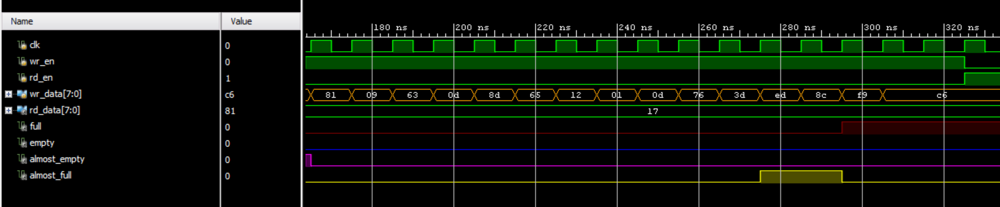
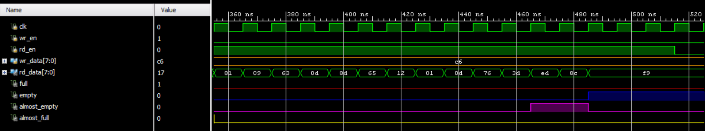
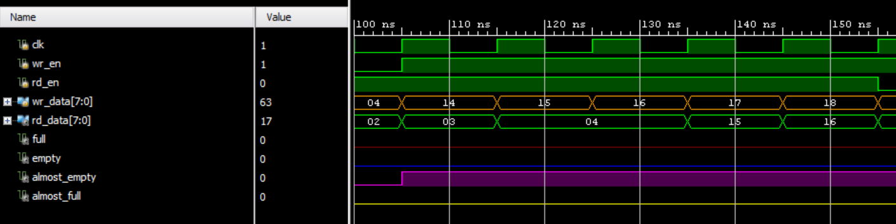
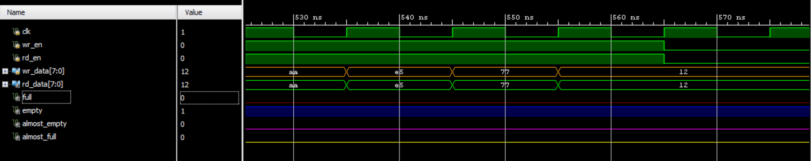

# FIFO Functional Verification Waveforms

This directory contains the simulation results for the **Synchronous FIFO** module. These waveforms verify the functional correctness of the RTL under various operating conditions, including boundary cases and simultaneous access.

---

## 1. Write Burst and Full Status

This waveform captures the FIFO being filled from an empty state.

* **Mechanism:** As `wr_en` remains high, `wr_data` is sampled on every rising edge of `clk`.
* **Flag Logic:** The `almost_full` flag asserts when the occupancy reaches `DEPTH - THRESHOLD`. Once the FIFO is completely filled, the `full` flag (red) asserts, and further writes are inhibited to prevent data overflow.

---

## 2. Read Burst and Empty Status

This waveform demonstrates the retrieval of data in the order it was stored (First-In, First-Out).

* **Mechanism:** With `rd_en` high, `rd_data` updates with the value at the current `rd_ptr`.
* **Flag Logic:** The `almost_empty` flag triggers when the number of elements is ≤ THRESHOLD. When the last element is read, the `empty` flag (blue) asserts, indicating no more valid data is available.

---

## 3. Simultaneous Read and Write

Verified here is the FIFO's ability to handle concurrent operations when it is partially full.

* **Result:** Since one element is written while another is read in the same clock cycle, the internal `occupancy` remains constant.
* **Stability:** Status flags remain stable, and data integrity is maintained as both pointers increment in parallel.

---

## 4. Zero-Latency Bypass Mode

A specific feature of this RTL is the bypass logic designed for when the FIFO is `empty`.

* **Logic:** If `wr_en` and `rd_en` are both asserted while `empty` is high, the `wr_data` is assigned directly to `rd_data`.
* **Verification:** In the waveform, you can see `rd_data` mirroring `wr_data` (e.g., values `aa`, `e5`, `77`) within the same clock cycle, bypassing the memory array for zero-cycle latency.

---

## Simulation Parameters

| Parameter | Value | Description |
|:---|:---|:---|
| **Clock Period** | 10ns | 100MHz operating frequency |
| **DEPTH** | 16 | Number of 8-bit slots |
| **THRESHOLD** | 2 | Margin for "Almost" flags |
